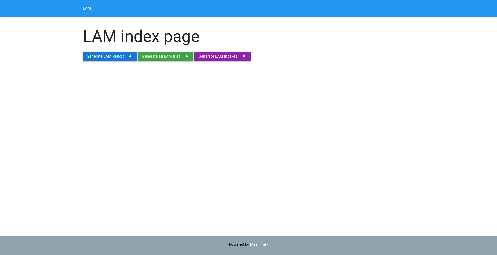
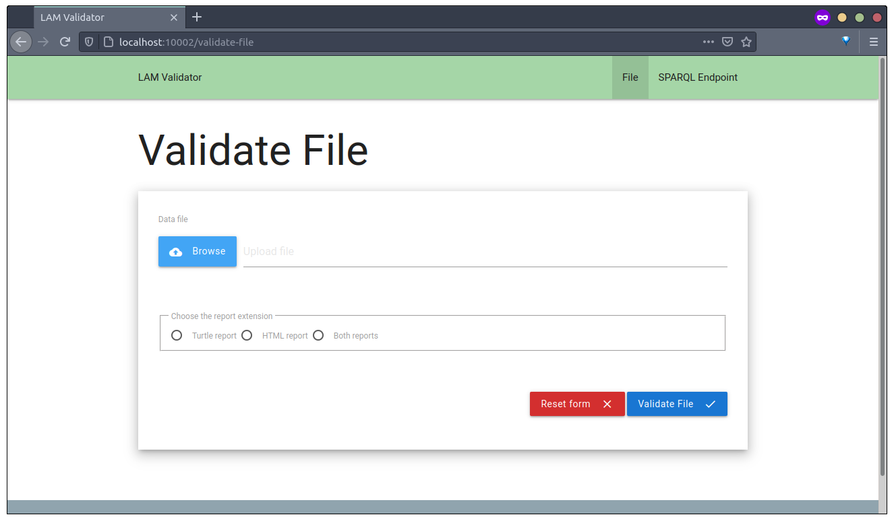
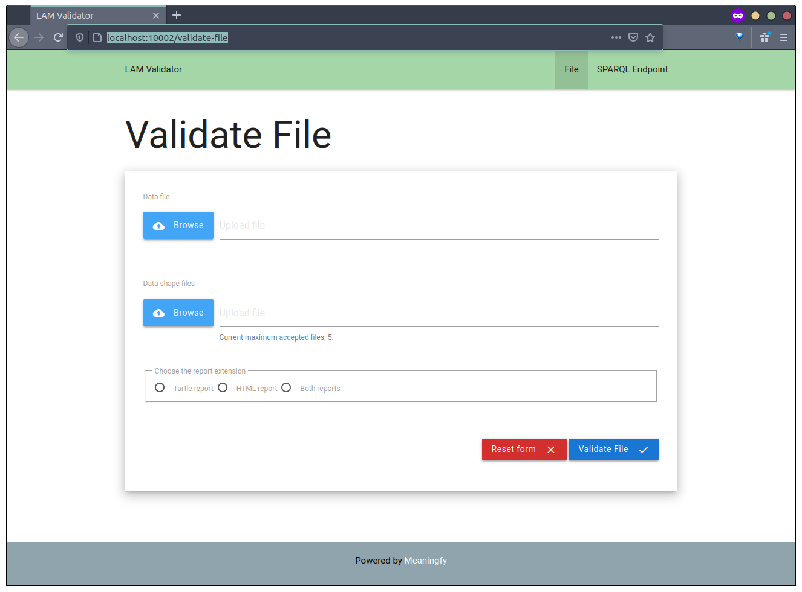

# lam-workflow
The deployment package for the LAM services.

This repository provides the enterprise architecture and description of capabilities necessary for the digital transformation of the asset publishing life-cycle workflow.   

# Documents
* The *architectural design* and the detailed deployment specifications are provided in the [Enterprise Architecture document](docs/lam-architecture/lam-enterprise-architecture.pdf). 
* The *technical guide* for installing and running the services are provided in the ["Installation guide"](docs/tech-manual/tech-manual.pdf). 


# Repository Structure
* `/docs` - the documentation specific to this project
  * `/docs/lam-architecture` - the LaTeX source of the enterprise architecture document
  * `/docs/references` - a database of literature references used in the enterprise architecture document and technical user manual 
  * `/docs/tech-manual` - the technical user manual for installing and running the services
* `/docker` - the docker files representing specification and configurations for running the services on a target server
* `README.md` - this file

# Services and their respective configurations
Please note that the configured values can be changed by modifying the [`/docker/.env`](./docker/.env) file.

### LAM Validator API

This service encapsulates the actual validation engine and exposes its functionality as an API.

|Description | Value | Associated variable|
|------------|-------|--------------------|
| Internal URL | http://lam-validator-api | RDF_VALIDATOR_API_LOCATION | 
| Port | 10001 | RDF_VALIDATOR_API_PORT|

*NOTE:* When validating SPARQL endpoints, the fully qualified domain name of the machine must be specified. As a consequence, `localhost` will not work.

### LAM Validator UI

|Description | Value | Associated variable|
|------------|-------|--------------------|
| Internal URL | http://lam-validator-ui | RDF_VALIDATOR_UI_LOCATION | 
| Port | 10002 | RDF_VALIDATOR_UI_PORT |

*NOTE:* When validating SPARQL endpoints, the fully qualified domain name of the machine must be specified. As a consequence, `localhost` will never work.

### LAM Generation Service API

|Description | Value | Associated variable|
|------------|-------|--------------------|
| Internal URL | http://lam-generation-service-api | LAM_API_LOCATION | 
| Port | 4050 | LAM_API_PORT|


### LAM Generation Service API

|Description | Value | Associated variable|
|------------|-------|--------------------|
| Internal URL | http://lam-generation-service-ui | LAM_UI_LOCATION | 
| Port | 8050 | LAM_UI_PORT|
### LAM Generation Service UI

|Description | Value | Associated variable|
|------------|-------|--------------------|
| Internal URL | http://lam-generation-service-ui | LAM_UI_LOCATION | 
| Port | 8050 | LAM_UI_PORT|

### LAM Fuseki

This is the triple store that is used by the LAM generation service software to generate the report and indexes.

|Description | Value | Associated variable|
|------------|-------|--------------------|
| Admin account password | admin | LAM_FUSEKI_ADMIN_PASSWORD|
| User name| admin | LAM_FUSEKI_USERNAME |
| Password | admin | LAM_FUSEKI_PASSWORD|
| Folder where Fuseki stores data | `./fuseki-lam-volume` | LAM_FUSEKI_DATA_FOLDER|
| Internal port | 3030 | LAM_FUSEKI_PORT |
| External port | 3010 | LAM_FUSEKI_EXTERNAL_PORT |
| Additional arguments passed to JVM | -Xmx2g | LAM_FUSEKI_JVM_ARGS|
| URL | http://rdf-differ-fuseki | LAM_FUSEKI_LOCATION |
| Query URL | /lam/query | LAM_FUSEKI_QUERY_URL |

> Please note that the URL is only available inside the same Docker containers network and is not visible from the outside. Its purpose is to provide a named way for a service to connect to another service.
# Requirements

### Hardware requirements

At least 8 Gb of RAM.
At least a dual core CPU.
At least 64Gb of free space.

### Software requirements 

A Linux distribution having a kernel with a version higher than 5.4.0.

### Ports

The following ports must be available on the host machine, as they will be bound to by different docker services:


|Port | Service|
|------------|-------|
|3010| LAM Fuseki|
|4050| LAM Generation Service API|
|8050| LAM Generation Service UI|
|10001| LAM Validator API|
|10002| LAM Validator UI|


# Deployment

### Install the Docker engine

 Please follow the official instructions located [here](https://docs.docker.com/engine/install/ubuntu/).
 
### Install Docker compose

Please follow the official instructions located [here](https://docs.docker.com/compose/install/).


### Clone the lam-workflow repository to your target machine
 
 Open a shell and paste the following line, then press `<Enter>`:

```
git clone https://github.com/meaningfy-ws/lam-workflow.git
``` 

### Download the docker images and start the containers

In the same shell, navigate to the repository "lam-workflow" (where Git cloned the repository).

> For additional configuration for the validator services visit [`lam-validator`'s github page](https://github.com/meaningfy-ws/lam-validator)

After this preparation command, run 
```shell script
make start-services
```
in the shell window.

To stop the services run:
```shell script
make stop-services
```

### Makefile targets

**validator-set-report-template**
- Syntax: **make location=</your-custom/shapes/location> validator-set-shacl-shapes**
- Used for: copying your custom validator report template inside the container's volume


**validator-set-shacl-shapes**
- Syntax: **make location=</your-custom/shapes/location> validator-set-shacl-shapes**
- Used for: copying your custom SHACL shapes inside the container's volume


# Contributing
You are more than welcome to help expand and mature this project. 

When contributing to this repository, please first discuss the change you wish to make via issue, email, or any other method with the owners of this repository before making a change.

Please note we adhere to [Apache code of conduct](https://www.apache.org/foundation/policies/conduct), please follow it in all your interactions with the project.  

# Licence 

The documents, such as reports and specifications, available in the /doc folder, are licenced under a [CC BY 4.0 licence](https://creativecommons.org/licenses/by/4.0/deed.en).

The scripts (stylesheets) and other executables are licenced under [GNU GPLv3](https://www.gnu.org/licenses/gpl-3.0.en.html) licence.


# LAM 4 DOC
Initiative for Modeling the Legal Analysis Methodology (LAM): Document generation service

# Work in progress

*Currently the project is under heavy development.*

The development version of the LAM HTML content is available [here](http://dev.meaningfy.ws:9090).
# User interface

The user interface is simple and intuitive. Choose what you need to generate and press the corresponding button.



### Makefile targets

**install**
- Upgrades PIP to the latest version and installs the local requirements

**test**
- Runs pytest which in turns executes the unit and BDD tests which are ran using headless Chrome. You need to successfully run the **install** target beforehand, as it installs the necessary prerequisites (the chrome browser and the driver which corresponds to that specific chrome browser version)

**test-with-ui**
- Runs pytest which in turns executes the unit and BDD tests which are ran using the fully UI enabled Chrome. You need to successfully run the **install** target beforehand, as it installs the necessary prerequisites (the chrome browser and the driver which corresponds to that specific chrome browser version). A "Chrome is being controlled by automated test software" message will be displayed on the top. Please wait for the tests to finish and do not interact with the browser window(s) driven by the BDD tests. 

**build-services**
- Uses docker-compose to build all the services defined in the docker/docker-compose.yml file.

**start-services**
- Uses docker-compose to start the services defined in the docker/docker-compose.yml file.

**stop-services**
- Uses docker-compose to stop the services defined in the docker/docker-compose.yml file.

**generate-indexes**
- Uses [eds4jinja2] to generate the indexes that will later be sent to ElasticSearch for indexing.

**generate-content**
- Uses [eds4jinja2] to generate the content that will be integrated in the portal.

**generate-tests-from-features**
- Based on the feature files, this target generates the missing Python test code.

# Indexes description

## CELEX

A CELEX index record contains the following fields:

- **celexURI**: The URI of the CELEX (for example http://publications.europa.eu/resources/authority/celex/c_1_nnn )
- **rdfTypes**: The RDF type(s) ( for example http://www.w3.org/2004/02/skos/core#Concept )
- **broaderConcepts**: The generalization(s) (for example**: http://publications.europa.eu/resources/authority/celex/c_1 )
- **broaderLabels**: The labels of the associated broader concepts (for example "Treaties")
- **collectionURIS**: The URIs of the collection(s) that the current result belongs to (for example http://publications.europa.eu/resources/authority/celex/class_1 )
- **collectionLabels**: The label(s) of the aforementioned collection(s) (for example "Celex sector 1") 
- **dttValues**: This one or two letters code refers to a specific type of document as indicated in the CELEX number. 
- **dtsValues**: This refers to a specific sector (collection) of documents as indicated in the CELEX number (it is the first number in the celex number).
- **dtaValues**: The year attributed to the document (internal number or ppf number).
- **dtnValues**: A sequential number representing the original reference number of the act. In some instances composed or non-standardised numbers are attributed (e.g. treaties).
- **labels**: The label of the current record, if any.
- **examples**: The example of the current record, if any.
- **editorialNotes**: The editorial note of the current record, if any.

For additional information, please consult [this file](templates/indexes/queries/celex.rq)

## Classes index

A class index record contains the following fields:

- **classURI**: The URI of the class (for example http://publications.europa.eu/resources/authority/lam/c_108)
- **types**: The RDF type(s) ( for example http://www.w3.org/2004/02/skos/core#Concept )
- **authors**: The author(s) of the current class (for example http://publications.europa.eu/resource/authority/corporate-body/CONSIL)
- **resourceTypes**: The resource type (for example http://publications.europa.eu/resource/authority/resource-type/STRATEGY_COMMON). This is also known as the type of act (lamd:md_fm).
- **collections**: The collection that the current class is part of (for example http://publications.europa.eu/resources/authority/lam/class_3OTHER)
- **dnClassValues**:
- **dc**: The Eurovoc concept for this specific class.
- **ct**: The subject matter concept for this specific class.
- **cc**: The directory code for this specific class.
- **labels**: The label(s) of the current class (for example "Common strategy , Common strategy , Common strategy , Common strategy (CFSP number), Common strategy (CFSP number), Common strategy (CFSP number)")
- **notes**: The notes of the current class (for example "Proposal**: strategy_council.")
- **examples**: The examples for the current class (for example "32003E0897, Common Strategy 2003/897/CFSP of the European Council of 12 December 2003 amending Common Strategy 1999/877/CFSP on Ukraine in order to extend the period of its application , Stratégie commune 2003/897/PESC du Conseil européen du 12 décembre 2003 modifiant la stratégie commune 1999/877/PESC à l'égard de l'Ukraine afin de proroger sa période d'application, 32003E0897, Common Strategy 2003/897/CFSP of the European Council of 12 December 2003 amending Common Strategy 1999/877/CFSP on Ukraine in order to extend the period of its application , Stratégie commune 2003/897/PESC du Conseil européen du 12 décembre 2003 modifiant la stratégie commune 1999/877/PESC à l'égard de l'Ukraine afin de proroger sa période d'application")

For additional information, please consult [this file](./templates/indexes/queries/classes.rq)

## Properties index

A property index record contains the following fields:

- **propertyURI**: The URI of the property (for example http://publications.europa.eu/resources/authority/lam/md_SUSPEND_PAR)
- **types**: The URI of the type of the property (for example http://www.w3.org/2004/02/skos/core#Concept) 
- **propertyCollections**: The URI(s) of the collection(s) that the property is part of (for example http://publications.europa.eu/resources/authority/lam/class_MSEA)
- **propertyCollectionLabels**: The label(s) of the collections that the property is part of (for example "Amendment to/Earlier related instruments")
- **propertyTypes**: The type(s) of the property (for example "object property")
- **skosDefinitions**: The SKOS definition(s) of the property (for example "Partial suspension (SP) - similar as Suspension")
- **editorialNotes**: The editorial notes for the property (for example "08/11/2019: Diferences between suspension and partial suspension? Is this really needed?")
- **examples**: The examples for the property (for example "<j.0:resource_legal_term-of-office rdf:datatype=\"http://www.w3.org/2001/XMLSchema#string\">VII (2020-2025)</j.0:resource_legal_term-of-office>")
- **historyNotes**: The history notes for the property (for example "Used by EUR-Lex quick search. Relevant for search in internal numbers for ECB, therefore this property is created in some ECB documents on purpose.")
- **scopeNotes**: The scope notes for the property (for example "32013R0298 → 32004R0314")
- **notations**: The notations for the property (for example "SUSPEND_PAR") 
- **labels**: The labels for the property (for example "Link: Partially suspends document")

For additional information, please consult [this file](./templates/indexes/queries/properties.rq)

# Contributing
You are more than welcome to help expand and mature this project. We adhere to [Apache code of conduct](https://www.apache.org/foundation/policies/conduct), please follow it in all your interactions on the project.   

When contributing to this repository, please first discuss the change you wish to make via issue, email, or any other method with the maintainers of this repository before making a change.

## Licence 
This project is licensed under [GNU GPLv3](https://www.gnu.org/licenses/gpl-3.0.en.html) licence. 

Powered by [Meaningfy](https://github.com/meaningfy-ws).


[eds4jinja2]: <https://pypi.org/project/eds4jinja2/> "eds4jinja2 on pypi"


# lam-validator
The LAM validator is used to perform validation of RDF content after it is exported from VocBench 3 platform. The validation procedure is based on SHACL data shape checking and is done using LAM-SKOS-AP application profile. 


# Repository Structure
* /docker -the docker files representing specification and configurations for running the services on a target server
* README.md - this file

# Services and their respective configurations
Please note that the configured values can be changed by modifying the [`/docker/.env`](./docker/.env) file.


### RDF Validator API

This service encapsulates the actual validation engine and exposes its functionality as an API.

|Description | Value | Associated variable|
|------------|-------|--------------------|
| Port | 10001 | VALIDATOR_API_PORT|

*NOTE:* When validating SPARQL endpoints, the fully qualified domain name of the machine must be specified. As a consequence, `localhost` will not work.

### RDF Validator UI

|Description | Value | Associated variable|
|------------|-------|--------------------|
| Port | 10002 | VALIDATOR_UI_PORT|

*NOTE:* When validating SPARQL endpoints, the fully qualified domain name of the machine must be specified. As a consequence, `localhost` will never work.

# Requirements

### Software requirements 

A Linux distribution having a kernel with a version higher than 5.4.0.

### Ports

The following ports must be available on the host machine, as they will be bound to by different docker services:

|Port | Service|
|------------|-------|
|10001| RDF Validator API|
|10002| RDF Validator user interface|


# Deployment

### Install the Docker engine

 Please follow the official instructions located [here](https://docs.docker.com/engine/install/ubuntu/).
 
### Install Docker compose

Please follow the official instructions located [here](https://docs.docker.com/compose/install/).


### Clone the lam-workflow repository to your target machine
 
 Open a shell and paste the following line, then press `<Enter>`:

```
git clone https://github.com/meaningfy-ws/lam-validator.git
``` 

### Download the docker images and start the containers

In the same shell, navigate to the repository "lam-validator" (where Git cloned the repository).

The default configuration uses the SHACL shapes defined in [`lam-skos-api.ttl`](resources/lam-skos-ap.ttl) and does not allow additional SHACL shapes to be used for validation.


To allow additional SHACL shapes  `RDF_VALIDATOR_ALLOWS_EXTRA_SHAPES` 
from [`.env`](docker/.env)
```
RDF_VALIDATOR_ALLOWS_EXTRA_SHAPES=True
```

After setting the extra shapes, the UI will adjust accordingly and you'll be able to upload additional shape files.



> Note! 
> For this update to take place restart the containers.

To add additional default SHACL shape files, put them in the [`resources`](resources) folder.

> Note! 
> For this update to take place you'll have to rebuild the containers.
```shell script
make build-services
 ```

## Run containers
After you have configured the project according to your needs run:
```shell script
make start-services
 ```
in the shell window to start the services.

## Makefile targets

**build-services**
- Uses docker-compose to build all the services defined in the docker/docker-compose.yml file.

**start-services**
- Uses docker-compose to start the services defined in the docker/docker-compose.yml file.

**stop-services**
- Uses docker-compose to stop the services defined in the docker/docker-compose.yml file.

# Contributing
You are more than welcome to help expand and mature this project. 

When contributing to this repository, please first discuss the change you wish to make via issue, email, or any other method with the owners of this repository before making a change.

Please note we adhere to [Apache code of conduct](https://www.apache.org/foundation/policies/conduct), please follow it in all your interactions with the project.  

# Licence 

The documents, such as reports and specifications, available in the /doc folder, are licenced under a [CC BY 4.0 licence](https://creativecommons.org/licenses/by/4.0/deed.en).

The scripts (stylesheets) and other executables are licenced under [GNU GPLv3](https://www.gnu.org/licenses/gpl-3.0.en.html) licence.

# lam-validator
The LAM validator is used to perform validation of RDF content after it is exported from VocBench 3 platform. The validation procedure is based on SHACL data shape checking and is done using LAM-SKOS-AP application profile. 


# Repository Structure
* /docker -the docker files representing specification and configurations for running the services on a target server
* README.md - this file

# Services and their respective configurations
Please note that the configured values can be changed by modifying the [`/docker/.env`](./docker/.env) file.


### RDF Validator API

This service encapsulates the actual validation engine and exposes its functionality as an API.

|Description | Value | Associated variable|
|------------|-------|--------------------|
| Port | 10001 | VALIDATOR_API_PORT|

*NOTE:* When validating SPARQL endpoints, the fully qualified domain name of the machine must be specified. As a consequence, `localhost` will not work.

### RDF Validator UI

|Description | Value | Associated variable|
|------------|-------|--------------------|
| Port | 10002 | VALIDATOR_UI_PORT|

*NOTE:* When validating SPARQL endpoints, the fully qualified domain name of the machine must be specified. As a consequence, `localhost` will never work.

# Requirements

### Software requirements 

A Linux distribution having a kernel with a version higher than 5.4.0.

### Ports

The following ports must be available on the host machine, as they will be bound to by different docker services:

|Port | Service|
|------------|-------|
|10001| RDF Validator API|
|10002| RDF Validator user interface|


# Deployment

### Install the Docker engine

 Please follow the official instructions located [here](https://docs.docker.com/engine/install/ubuntu/).
 
### Install Docker compose

Please follow the official instructions located [here](https://docs.docker.com/compose/install/).


### Clone the lam-workflow repository to your target machine
 
 Open a shell and paste the following line, then press `<Enter>`:

```
git clone https://github.com/meaningfy-ws/lam-validator.git
``` 

### Download the docker images and start the containers

In the same shell, navigate to the repository "lam-validator" (where Git cloned the repository).

The default configuration uses the SHACL shapes defined in [`lam-skos-api.ttl`](resources/lam-skos-ap.ttl) and does not allow additional SHACL shapes to be used for validation.


To allow additional SHACL shapes  `RDF_VALIDATOR_ALLOWS_EXTRA_SHAPES` 
from [`.env`](docker/.env)
```
RDF_VALIDATOR_ALLOWS_EXTRA_SHAPES=True
```

After setting the extra shapes, the UI will adjust accordingly and you'll be able to upload additional shape files.


> Note! 
> For this update to take place restart the containers.

To add additional default SHACL shape files, put them in the [`resources`](resources) folder.

> Note! 
> For this update to take place you'll have to rebuild the containers.
```shell script
make build-services
 ```

## Run containers
After you have configured the project according to your needs run:
```shell script
make start-services
 ```
in the shell window to start the services.

## Makefile targets

**build-services**
- Uses docker-compose to build all the services defined in the docker/docker-compose.yml file.

**start-services**
- Uses docker-compose to start the services defined in the docker/docker-compose.yml file.

**stop-services**
- Uses docker-compose to stop the services defined in the docker/docker-compose.yml file.

# Contributing
You are more than welcome to help expand and mature this project. 

When contributing to this repository, please first discuss the change you wish to make via issue, email, or any other method with the owners of this repository before making a change.

Please note we adhere to [Apache code of conduct](https://www.apache.org/foundation/policies/conduct), please follow it in all your interactions with the project.  

# Licence 

The documents, such as reports and specifications, available in the /doc folder, are licenced under a [CC BY 4.0 licence](https://creativecommons.org/licenses/by/4.0/deed.en).

The scripts (stylesheets) and other executables are licenced under [GNU GPLv3](https://www.gnu.org/licenses/gpl-3.0.en.html) licence.
